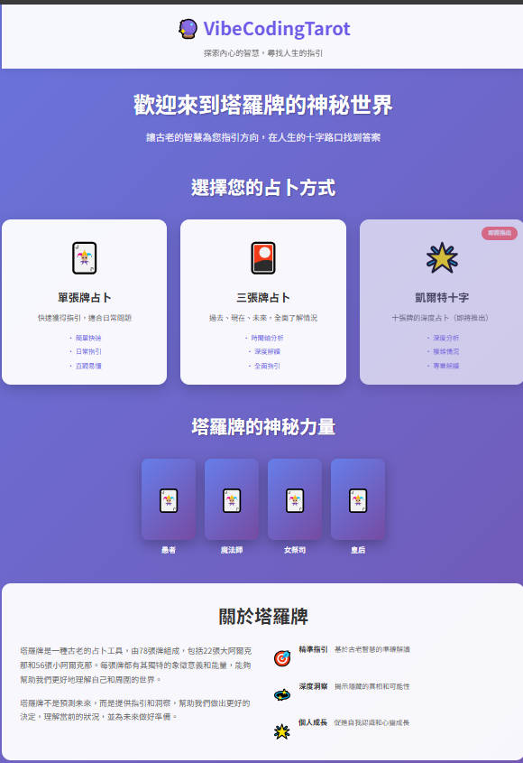

# 🔮 VibeCodingTarot - 塔羅牌占卜網站

一個基於Python Flask的塔羅牌占卜網站，提供單張牌和三張牌占卜服務。



## ✨ 功能特色

- **單張牌占卜**：快速獲得指引，適合日常問題
- **三張牌占卜**：過去-現在-未來的時間軸分析
- **正位/逆位解讀**：完整的塔羅牌含義解釋
- **響應式設計**：支援桌面和移動設備
- **美觀界面**：現代化的UI設計和動畫效果
- **中文支援**：完整的中文界面和內容

## 🚀 快速開始

### 環境要求

- Python 3.7+
- Flask 2.0+

### 安裝步驟

1. **克隆項目**
   ```bash
   git clone <repository-url>
   cd VibeCodingTarot
   ```

2. **安裝依賴**
   ```bash
   pip install -r requirements.txt
   ```

3. **運行應用**
   ```bash
   python app.py
   ```

4. **訪問網站**
   打開瀏覽器訪問 `http://localhost:5000`

## 📁 項目結構

```
VibeCodingTarot/
├── app.py                 # Flask主應用
├── requirements.txt       # Python依賴
├── PRD.md                # 產品需求文檔
├── README.md             # 項目說明
├── data/
│   └── tarot_cards.json  # 塔羅牌數據
├── templates/
│   ├── index.html        # 主頁
│   ├── single_card.html  # 單張牌占卜
│   └── three_cards.html  # 三張牌占卜
└── static/
    ├── css/
    │   └── style.css     # 主樣式文件
    └── js/
        └── main.js       # 主JavaScript文件
```

## 🎯 使用說明

### 單張牌占卜

1. 訪問 `/single-card` 頁面
2. 在問題框中輸入您想詢問的問題（可選）
3. 點擊「抽取塔羅牌」按鈕
4. 查看塔羅牌的正位/逆位含義和解讀

### 三張牌占卜

1. 訪問 `/three-cards` 頁面
2. 在問題框中輸入您想詢問的問題（可選）
3. 點擊「抽取三張塔羅牌」按鈕
4. 查看過去、現在、未來的塔羅牌解讀

## 🔧 API 端點

- `GET /` - 主頁
- `GET /single-card` - 單張牌占卜頁面
- `GET /three-cards` - 三張牌占卜頁面
- `POST /api/draw-single` - 抽取單張牌
- `POST /api/draw-three` - 抽取三張牌
- `GET /api/card/<card_id>` - 獲取特定牌的信息
- `POST /api/save-reading` - 保存占卜記錄

## 🎨 技術特色

### 後端技術
- **Flask**：輕量級Python Web框架
- **JSON數據存儲**：塔羅牌數據以JSON格式存儲
- **RESTful API**：標準的API設計

### 前端技術
- **HTML5**：語義化標記
- **CSS3**：現代化樣式設計，支援響應式布局
- **JavaScript ES6+**：現代JavaScript功能
- **動畫效果**：流暢的用戶界面動畫

### 設計特色
- **漸層背景**：美觀的紫色漸層設計
- **卡片式布局**：直觀的卡片式界面
- **動畫效果**：抽牌動畫和懸停效果
- **響應式設計**：適配各種屏幕尺寸

## 📱 響應式設計

網站完全支援響應式設計，在以下設備上都能完美顯示：

- 桌面電腦（1200px+）
- 平板電腦（768px - 1199px）
- 手機（< 768px）

## 🔮 塔羅牌數據

項目包含22張大阿爾克那塔羅牌的完整數據：

- 愚者、魔法師、女祭司、皇后、皇帝
- 教皇、戀人、戰車、力量、隱者
- 命運之輪、正義、倒吊人、死神、節制
- 惡魔、高塔、星星、月亮、太陽
- 審判、世界

每張牌都包含：
- 中文名稱和英文名稱
- 正位和逆位含義
- 詳細描述和關鍵詞
- 牌組分類

## 🛠️ 開發說明

### 添加新的塔羅牌

1. 編輯 `data/tarot_cards.json` 文件
2. 按照現有格式添加新的牌數據
3. 重新啟動應用

### 自定義樣式

1. 編輯 `static/css/style.css` 文件
2. 修改CSS變量或添加新的樣式規則
3. 刷新瀏覽器查看效果

### 添加新功能

1. 在 `app.py` 中添加新的路由
2. 在 `templates/` 中創建對應的HTML模板
3. 在 `static/js/main.js` 中添加JavaScript功能

## 📄 許可證

此項目僅供學習和個人使用。

## 🤝 貢獻

歡迎提交Issue和Pull Request來改進這個項目！

## 📞 聯繫

如有問題或建議，請通過GitHub Issues聯繫。

---

**VibeCodingTarot** - 探索內心的智慧，尋找人生的指引 ✨